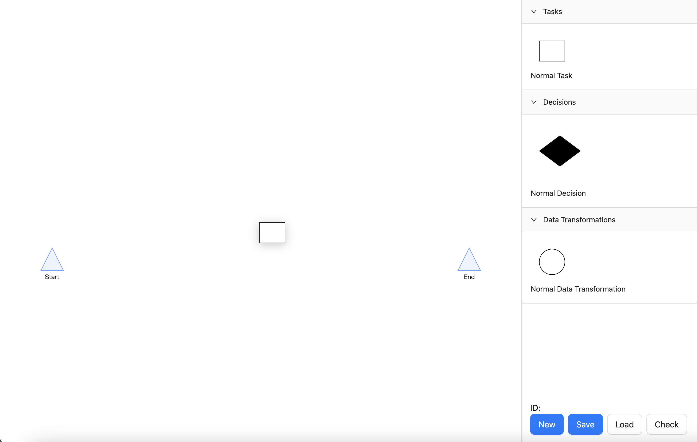
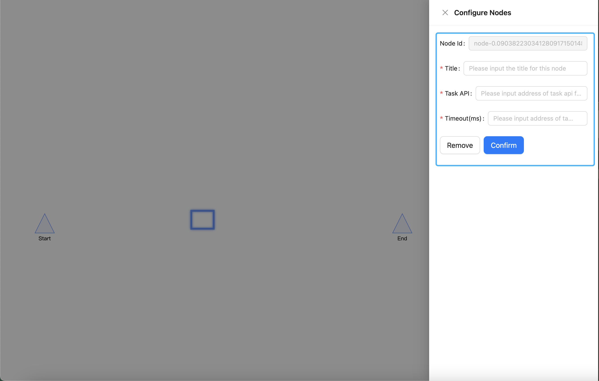
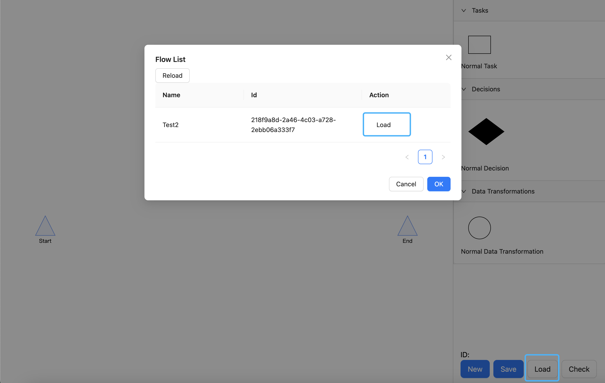
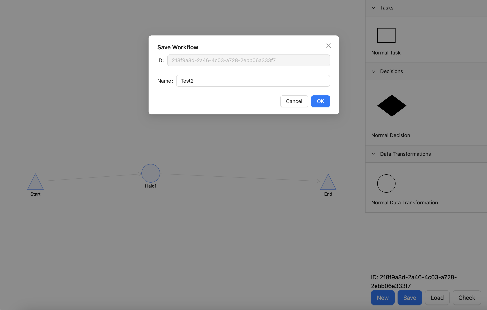

# workflow-canvas
This is a demo project of workflow visualization system.

**Design Doc:**
[[Technical Design] Design a Workflow Development Component](https://wr0iq5jkqh.feishu.cn/docx/PMMsdzCRaoHl1DxPZLzcQusinle)

## Run
To install dependencies and bootstrap dev-server

> pnpm install (yarn install | npm install)
>
> cd server && pnpm install
>
> pnpm run dev

## Usage

### Overview

In this view, you can see all the items in system. They are:

1. Main canvas area on the left, you can operate nodes in the canvas, includes:
   1. Drag nodes / select nodes
   2. Hold alt / option key and select one node, you can create edge to another node
2. Node's panel on the right, includes task/decision/data transformation nodes in the workflow. You can drag a type of node into the canvas area to create a new node.
3. Button bar on the bottom right. You can:
   1. Create new workflow
   2. Save current workflow
   3. Load existing workflow

### Drag item into canvas

Drag a item into canvas and drop it, you will create a new node of this type.

### Config selected node

Click one node and you can modify this node's configurations in the drawer appearing on the right. Form items can be different depending on the type of selected node.
Also, you can remove selected node in this drawer.

### Load existing workflows

Click load button in the button bar, it will render a workflow list modal that allows you to choose one existing workflow and load it into the canvas.

### Save workflow

By clicking save button and type the name for the workflow, you can save this workflow into the database.
